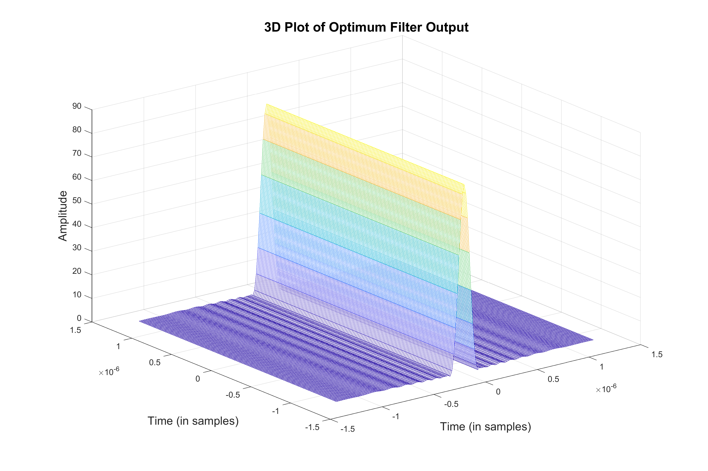

# SAR Range-Doppler Algorithm with Optimized Mismatched Filter

[](https://www.mathworks.com/)
[](LICENSE)
[](paper/)

> **Implementation of the published paper:**
>
> *"Optimization of a Mismatched Filter for SAR Imaging Using a QCQP Approach"*
> Mohamed Sakr et al. — **ASAT Conference**, Volume 20, Issue 20, pp. 1–12, 2024

---

## 📖 Overview

This repository provides the **MATLAB implementation** of a synthetic aperture radar (SAR) imaging pipeline based on the **Range-Doppler Algorithm (RDA)**, enhanced with an **optimized mismatched filter** designed via a **Quadratically Constrained Quadratic Program (QCQP)** approach.

The standard matched filter in SAR processing suffers from high range sidelobes that degrade image quality. This work proposes a QCQP-based mismatched filter that achieves **lower sidelobes** while maintaining a high **peak-to-sidelobe ratio (PSLR)** and **integrated sidelobe ratio (ISLR)**.

---

## 🎯 Key Contributions

- ✅ **Optimized Mismatched Filter** designed via QCQP for SAR range compression
- ✅ **Modified Range-Doppler Algorithm (RDA)** integrating the optimized filter
- ✅ Point target simulation for quantitative evaluation
- ✅ Windowed RDA baseline for comparison
- ✅ Significant reduction in **range sidelobes** vs. matched filter
- ✅ Results validated with **PSLR** and **ISLR** metrics

---

## 🗞️ Publication

> **Optimization of a Mismatched Filter for SAR Imaging Using a QCQP Approach**
> *Mohamed Sakr, et al.*
> 📰 **ASAT Conference Proceedings**, Volume 20, Issue 20, Pages 1–12, 2024

📄 See [`paper/ASAT-Volume 20-Issue 20- Page 1-12.pdf`](paper/)

```bibtex
@inproceedings{sakr2024qcqp,
  title     = {Optimization of a Mismatched Filter for SAR Imaging Using a QCQP Approach},
  author    = {Sakr, Mohamed and others},
  booktitle = {Proceedings of the ASAT Conference},
  volume    = {20},
  number    = {20},
  pages     = {1--12},
  year      = {2024}
}
```

---

## 📁 Repository Structure

```text
sar-rda-mismatched-filter/
│
├── README.md
├── LICENSE
│
├── matlab/
│   ├── optimized_mismatched_filter.m   ← QCQP filter design
│   ├── Modified_RDA_imaging.m          ← RDA with optimized filter
│   └── RDA_imaging_with_window.m       ← Baseline windowed RDA
│
├── results/
│   └── OptimumFilterOutput.png         ← Output figure from simulation
│
└── paper/
    └── ASAT-Volume 20-Issue 20- Page 1-12.pdf
```

---

## 🔬 Methodology

### 1. Mismatched Filter Optimization (QCQP)

The filter design is formulated as a **Quadratically Constrained Quadratic Program (QCQP)**:

- **Objective:** Minimize integrated sidelobe level
- **Constraint:** Bound on main-lobe distortion
- **Input:** LFM (Linear Frequency Modulated) chirp signal
- **Output:** Optimized filter coefficients with reduced sidelobes

**File:** `matlab/optimized_mismatched_filter.m`

### 2. Modified Range-Doppler Algorithm (RDA)

The standard RDA pipeline is modified to use the QCQP-optimized mismatched filter:

```
Raw SAR Signal
    → Range FFT
    → Range Compression (Optimized Mismatched Filter)
    → Range IFFT
    → Azimuth FFT
    → RCMC (Range Cell Migration Correction)
    → Azimuth Compression
    → Azimuth IFFT
    → Focused SAR Image
```

**Simulation parameters:**

| Parameter | Value |
|-----------|-------|
| Slope distance (R_nc) | 20 km |
| Radar speed (Vr) | 150 m/s |
| Pulse duration (Tr) | 2.5 μs |
| Range modulation rate (Kr) | 15 × 10¹² Hz/s |
| Carrier frequency (f0) | 5.3 GHz (C-band) |
| Doppler bandwidth | 80 Hz |
| Range sampling rate (Fr) | 60 MHz |
| Azimuth samples (Naz) | 1024 |
| Range samples (Nrg) | 320 |

**File:** `matlab/Modified_RDA_imaging.m`

### 3. Baseline Comparison — Windowed RDA

A standard RDA with a **window function** (e.g., Hamming/Taylor) is implemented as a baseline for comparison.

**File:** `matlab/RDA_imaging_with_window.m`

---

## 📊 Results

### Optimum Filter Output



> The optimized mismatched filter demonstrates significantly reduced sidelobes compared to a matched filter baseline, while preserving main-lobe fidelity.

---

## ⚙️ Requirements

- **MATLAB** R2021a or later
- **Optimization Toolbox** (for QCQP solver — `quadprog`)
- No additional toolboxes required for RDA imaging scripts

---

## ▶️ How to Run

### Step 1 — Design the optimized filter
```matlab
% In MATLAB:
run('matlab/optimized_mismatched_filter.m')
```

### Step 2 — Run the modified RDA with the optimized filter
```matlab
run('matlab/Modified_RDA_imaging.m')
```

### Step 3 — Run the windowed RDA baseline for comparison
```matlab
run('matlab/RDA_imaging_with_window.m')
```

> **Note:** Run `optimized_mismatched_filter.m` first — it generates the filter coefficients used by `Modified_RDA_imaging.m`.

---

## 🔗 Related Work

| Repository | Description |
|------------|-------------|
| [sar-autofocus-resunet-classification](https://github.com/sakrmtc/sar-autofocus-resunet-classification) | Deep learning SAR autofocus (ResU-Net) — JARS 2024 |
| [deep-learning-remote-sensing](https://github.com/sakrmtc/deep-learning-remote-sensing) | CNN terrain classifier + Res-U-Net notebooks |

---

## 👤 Author

**Mohamed Sakr** — PhD Researcher  
*SAR Image Processing · Deep Learning · Remote Sensing*

🔗 GitHub: [github.com/sakrmtc](https://github.com/sakrmtc)

---

## 📜 License

This repository is released under the **MIT License**. See `LICENSE` for details.
